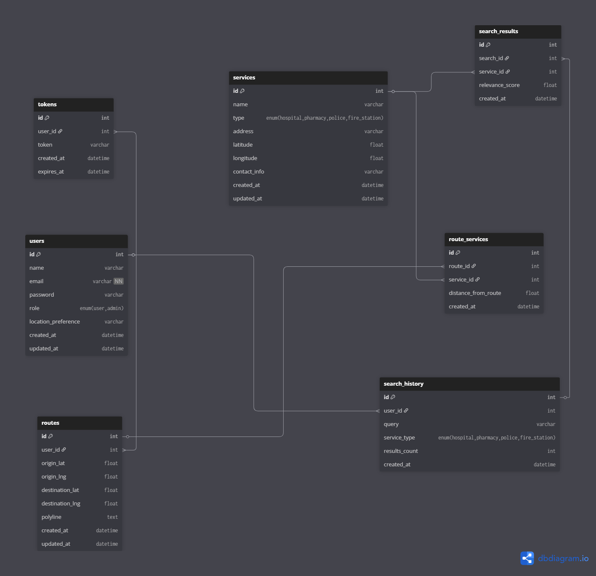

# 🛡️ SafeRoute API

SafeRoute API is a Django REST Framework backend service that helps users find **safe routes** and **critical emergency services** (hospitals, police stations, fire stations) based on their location.  
It uses **OpenStreetMap Nominatim API** to fetch geolocation data and integrates **Redis caching** to optimize repeated queries.  

This project is designed for **real-world applicability** and **scalability**, with clean architecture, clear API documentation, and deployment readiness.

---

## 📖 Real-World Problem & Solution

**Problem:**  
In emergencies, people often don’t know the safest and quickest path to the nearest hospital or police station.  
Existing apps focus on directions but don’t prioritize **safety-related services along the route**.

**Solution:**  
SafeRoute API bridges that gap by integrating real-time location lookups, mapping safety facilities, and storing frequently accessed results in cache for fast performance.  

---

## ✨ Features

- **Nearby Services Lookup** – Search for hospitals, police stations, fire stations by user’s coordinates.
- **Route Safety Analysis** – Get directions and see emergency service locations along the way.
- **User Profiles** – Save frequently used locations and preferred service types.
- **Caching with Redis** – Reduce API calls and improve speed.
- **Secure Authentication** – Token-based authentication with Django REST Framework.
- **Pagination & Filtering** – Efficient API data handling.
- **Scalable Architecture** – Separation of concerns with multiple apps.
- **API Documentation** – DRF browsable API & Postman Collection.

saferoute/               # Main Django project folder
│
├── users/               # App 1: User management
│   ├── models.py        # User, Token
│   ├── views.py         # Register, Login, Logout, Profile
│   ├── serializers.py
│   └── urls.py
│
├── services/            # App 2: Emergency services
│   ├── models.py        # Service
│   ├── views.py         # CRUD for services
│   ├── serializers.py
│   └── urls.py
│
├── search/              # App 3: Search & history
│   ├── models.py        # SearchHistory, SearchResult
│   ├── views.py         # Search endpoint
│   ├── serializers.py
│   └── urls.py
│
├── routes/              # App 4: Route safety analysis
│   ├── models.py        # Route, RouteService
│   ├── views.py         # Route endpoint
│   ├── serializers.py
│   └── urls.py
│
├── saferoute/           # Django project settings
│   ├── settings.py
│   ├── urls.py
│   └── wsgi.py
│
└── manage.py


---

## 🛠 Tech Stack

- **Backend:** Python, Django, Django REST Framework  
- **Database:** PostgreSQL (SQLite for local dev)  
- **Caching:** Redis  
- **External API:** [OpenStreetMap Nominatim API](https://nominatim.openstreetmap.org/)  
- **Authentication:** DRF Token Auth  
- **Deployment:** Render / Railway  

---

## 📦 Models

The SafeRoute API uses Django ORM models to represent users, services, and search history.  
Below is an overview of the key models and their relationships.

---

### 👤 User
Represents the system users (both citizens and admins).

| Field                | Type      | Description                           |
|----------------------|-----------|---------------------------------------|
| `id`                 | Integer   | Primary key                           |
| `name`               | String    | Full name of the user                 |
| `email`              | String    | Unique email address (used for login) |
| `password`           | String    | Hashed password                       |
| `role`               | Enum      | `user` (default) or `admin`           |
| `location_preference`| String    | Optional saved location preference     |
| `created_at`         | DateTime  | When the account was created          |
| `updated_at`         | DateTime  | Last account update                   |

---

### 🏥 Service
Represents an emergency service (hospital, pharmacy, police station, etc.).

| Field        | Type    | Description                              |
|--------------|---------|------------------------------------------|
| `id`         | Integer | Primary key                              |
| `name`       | String  | Service name (e.g., "City Hospital")     |
| `type`       | Enum    | `hospital`, `pharmacy`, `police`, `fire_station` |
| `address`    | String  | Service address                          |
| `latitude`   | Float   | GPS latitude                             |
| `longitude`  | Float   | GPS longitude                            |
| `contact`    | String  | Optional phone/email contact info        |
| `created_at` | DateTime| When the service was added               |
| `updated_at` | DateTime| Last service update                      |

---

### 🔍 SearchHistory
Stores past search queries made by users.

| Field         | Type    | Description                              |
|---------------|---------|------------------------------------------|
| `id`          | Integer | Primary key                              |
| `user_id`     | FK → User | User who performed the search          |
| `query`       | String  | Address or GPS coordinates searched      |
| `service_type`| Enum    | Optional filter (`hospital`, etc.)       |
| `results_count`| Int    | Number of results found                  |
| `created_at`  | DateTime| When the search was performed            |

---

### 📑 SearchResult
Links a search query with the services returned.

| Field         | Type    | Description                              |
|---------------|---------|------------------------------------------|
| `id`          | Integer | Primary key                              |
| `search_id`   | FK → SearchHistory | Search that generated the result |
| `service_id`  | FK → Service | Service included in the results     |
| `relevance_score` | Float | Ranking score (optional)               |
| `created_at`  | DateTime| When the result was stored               |

---

### 🔑 Token
Stores JWT refresh tokens for authentication.

| Field        | Type    | Description                              |
|--------------|---------|------------------------------------------|
| `id`         | Integer | Primary key                              |
| `user_id`    | FK → User | Owner of the token                     |
| `token`      | String  | JWT refresh token                        |
| `created_at` | DateTime| When the token was created               |
| `expires_at` | DateTime| When the token expires                   |

---

### 🔗 Relationships
- **User → SearchHistory** (1-to-many)  
- **SearchHistory → SearchResult** (1-to-many)  
- **Service → SearchResult** (1-to-many)  
- **User → Tokens** (1-to-many)  


---

## 🗺 ERD Diagram



---

## 📡 API Endpoints
## 🔑 Authentication
Most endpoints require authentication using **JWT tokens**.  
- Obtain a token via `/api/users/login/`.  
- Include it in requests:  
  ```http
  Authorization: Bearer <your_token>
  ```

---

## 👤 Users Endpoints
Manage user accounts, authentication, and profiles.

| Method | Endpoint               | Description                          | Auth Required |
|--------|------------------------|--------------------------------------|---------------|
| POST   | `/api/users/register/` | Register a new user                  | ❌ |
| POST   | `/api/users/login/`    | Login and obtain JWT token           | ❌ |
| POST   | `/api/users/logout/`   | Logout (invalidate token)            | ✅ |
| GET    | `/api/users/profile/`  | Retrieve logged-in user profile      | ✅ |
| PUT    | `/api/users/profile/`  | Update user profile                  | ✅ |
| GET    | `/api/users/`          | List all users (admin only)          | ✅ (Admin) |
| DELETE | `/api/users/{id}/`     | Delete a user (admin only)           | ✅ (Admin) |

---

## 🏥 Services Endpoints
Manage and retrieve emergency services (hospitals, pharmacies, police, fire stations).

| Method | Endpoint                  | Description                         | Auth Required |
|--------|---------------------------|-------------------------------------|---------------|
| GET    | `/api/services/`          | List all services (filter by `type`) | ✅ |
| GET    | `/api/services/{id}/`     | Retrieve details of a service        | ✅ |
| POST   | `/api/services/`          | Add a new service (admin only)       | ✅ (Admin) |
| PUT    | `/api/services/{id}/`     | Update service info (admin only)     | ✅ (Admin) |
| DELETE | `/api/services/{id}/`     | Delete service (admin only)          | ✅ (Admin) |

---

## 🔍 Search Endpoints
Search for nearby emergency services and manage search history.

| Method | Endpoint                       | Description                         | Auth Required |
|--------|--------------------------------|-------------------------------------|---------------|
| POST   | `/api/search/`                 | Search services by location & type  | ✅ |
| GET    | `/api/search/history/`         | Retrieve logged-in user search history | ✅ |
| DELETE | `/api/search/history/{id}/`    | Delete a specific search history entry | ✅ |

---

## 🛣 Routes Endpoints
Perform **Route Safety Analysis** using OpenStreetMap (ORS).  

| Method | Endpoint              | Description                           | Auth Required |
|--------|-----------------------|---------------------------------------|---------------|
| POST   | `/api/routes/`        | Create a safe route (origin → destination) with nearby services | ✅ |
| GET    | `/api/routes/`        | List routes created by logged-in user | ✅ |
| GET    | `/api/routes/{id}/`   | Retrieve a specific saved route       | ✅ |
| DELETE | `/api/routes/{id}/`   | Delete a saved route                  | ✅ |

Example Response for `/api/routes/`:
```json
{
  "route": [[-1.2921, 36.8219], [-1.3000, 36.8300]],
  "nearby_services": [
    {"id": 1, "name": "Nairobi Hospital", "type": "hospital"},
    {"id": 5, "name": "Central Police Station", "type": "police"}
  ]
}
```

---

## 📖 API Documentation
Interactive API docs are available via **Swagger**:

| Method | Endpoint      | Description |
|--------|---------------|-------------|
| GET    | `/api/docs/`  | Swagger UI / ReDoc API documentation |

---

## ✅ Summary
- **Users App** → Registration, login, profiles, admin user management  
- **Services App** → Emergency services CRUD & filtering  
- **Search App** → Nearby service search + history  
- **Routes App** → Safe routes with emergency services along the path  

Total: **15 endpoints** (core + admin).  

---

## 🚀 Caching Strategy

We use **Redis** to cache results of:
- Nearby services queries
- Frequent route lookups

**Implementation in DRF:**
- When a request is made for a location, check Redis cache first.
- If not found, fetch from API, store in Redis, and return.
- Cache expires after **1 hour**.

---

## 📅 Project Timeline

| Week | Phase                | Tasks |
|------|----------------------|-------|
| 1    | Idea & Planning       | Define project scope, choose API, design models |
| 2    | Design Phase          | Create ERD, API endpoint list, architecture plan |
| 3    | Start Building        | Set up Django project, configure DRF, implement user auth |
| 4    | Continue Building     | Implement service lookups, integrate caching, write tests |
| 5    | Finalize & Submit     | Optimize, write README, deploy, create demo video |

---

## ⚙ Installation

```bash
git clone https://github.com/yourusername/saferoute-api.git
cd saferoute-api
python -m venv venv
source venv/bin/activate  # or venv\Scripts\activate on Windows
pip install -r requirements.txt
python manage.py migrate
python manage.py runserver
```

---

## 🧪 Testing

```bash
python manage.py test
```

---

## 📄 License
MIT License

---

## 👤 Author
Rich Benjamin — [LinkedIn](https://www.linkedin.com/in/rich-mwendwa-b3296a302/) | [GitHub](https://github.com/RichBen03)
